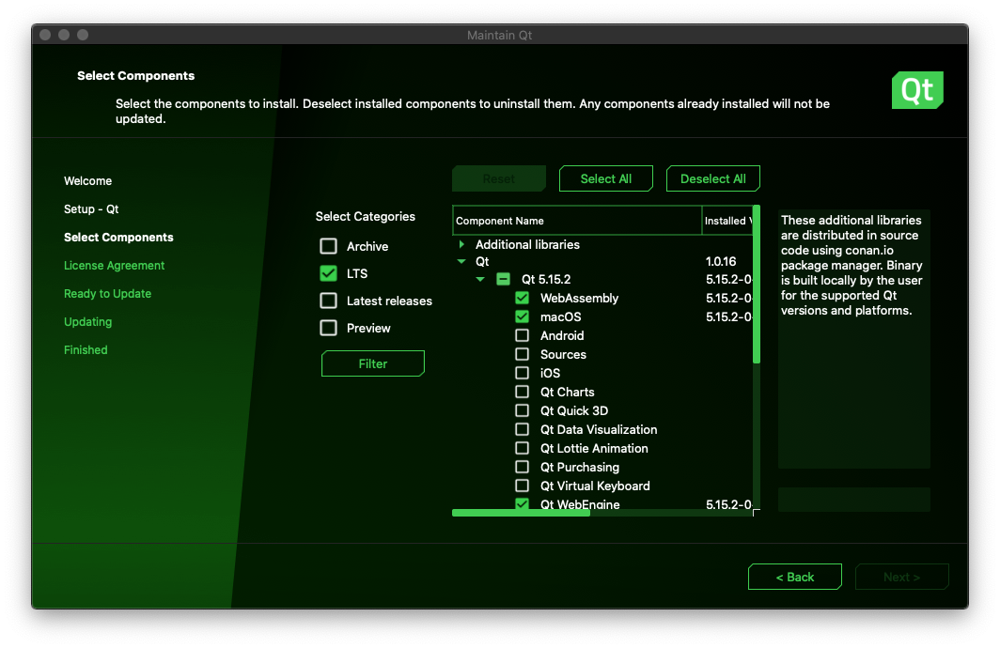
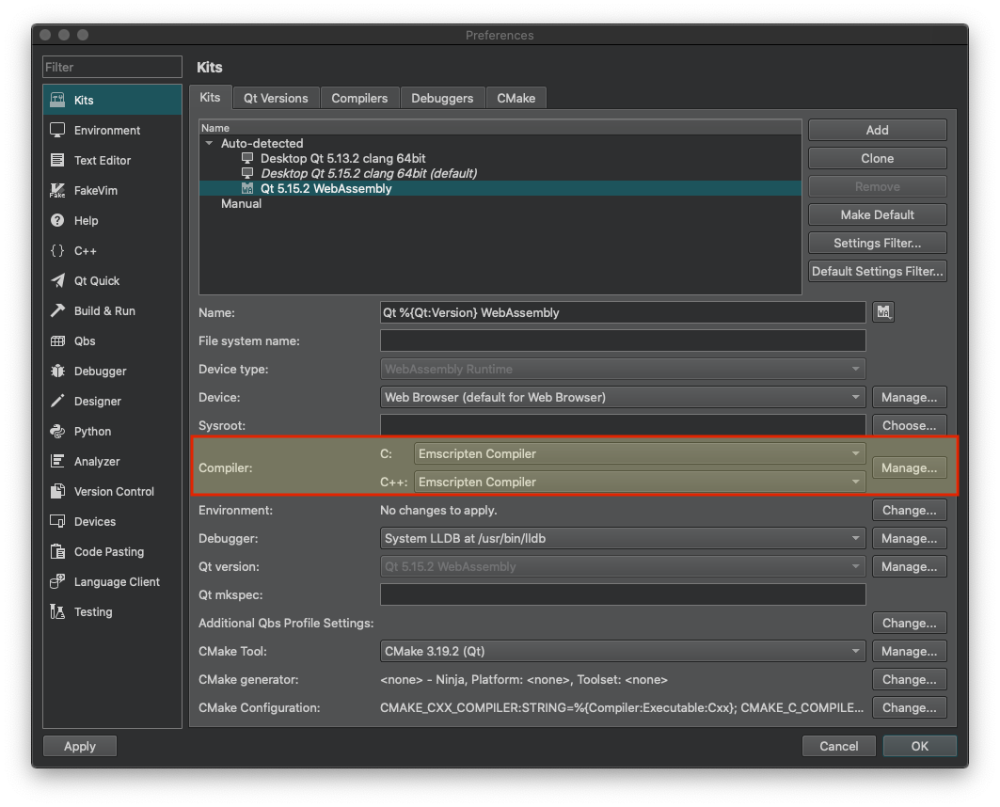
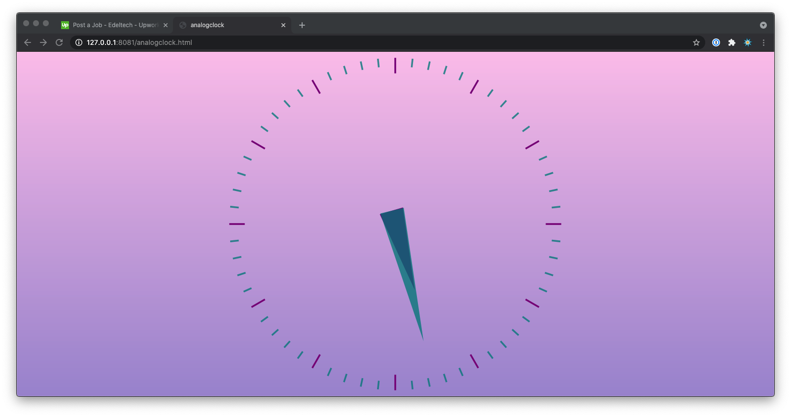
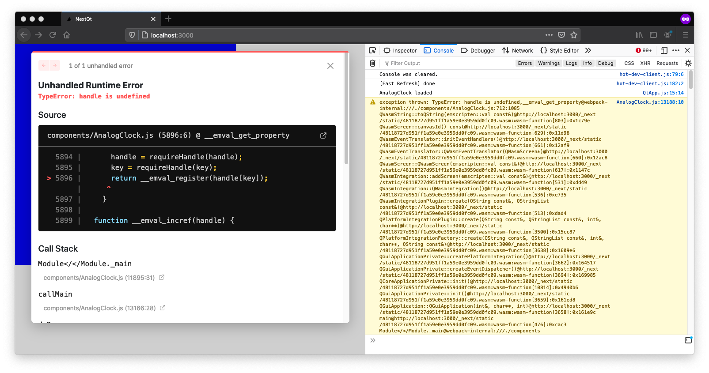

Qt WASM and Next.js integration example
=======================================

This repository contains an example Qt/WASM project embedded in a Next.js application.

### Requirements

* [Qt 5.15](https://www.qt.io/)

Contents
--------

###  `qtsrc`

The source code of the Qt Application. We modify the .pro to compile the WASM app as an ES6 module by adding the following to `analogclock.pro`:

```
QMAKE_LFLAGS += '-s USE_ES6_IMPORT_META=0 -s EXPORT_ES6=1 -s MODULARIZE=1 -s ENVIRONMENT="web"'
```

#### Build the application for Web Assembly

Begin by installing the Qt WebAssembly kit if you don't have it already. This can be done through your Qt installation's maintenance tool:



Next, install [emscripten](https://emscripten.org) version `1.39.8` ([required for Qt 5.15](https://doc.qt.io/qt-5/wasm.html)). It can be installed anywhere on your machine. We recommend installing in your `Code` folder:

    $ cd ~/Code
    $ git clone https://github.com/emscripten-core/emsdk.git
    $ cd emsdk
    $ ./emsdk install 1.39.8
    $ ./emsdk activate 1.39.8


**Ignore the recommendations about adding emsdk tools to your PATH.**

Qt Creator looks for a `.emscripten` configuration file in your home directory to build Web Assembly projects. Therefore, copy the `.emscripten` file located in your `emsdk` directory to your home directory.

    $ cp .emscripten ~

The path to the `emsdk` directory must be hard-coded since Qt Creator doesn't interprete the file's Python code:

```diff
-import os
-emsdk_path = os.path.dirname(os.environ.get('EM_CONFIG')).replace('\\', '/')
-NODE_JS = emsdk_path + '/node/14.15.5_64bit/bin/node'
-PYTHON = emsdk_path + '/python/3.9.2-1_64bit/bin/python3'
-LLVM_ROOT = emsdk_path + '/upstream/bin'
-BINARYEN_ROOT = emsdk_path + '/upstream'
-EMSCRIPTEN_ROOT = emsdk_path + '/upstream/emscripten'
+NODE_JS = '/path/to/emsdk/node/14.15.5_64bit/bin/node'
+PYTHON = '/path/to/emsdk/python/3.9.2-1_64bit/bin/python3'
+LLVM_ROOT = '/path/to/emsdk/upstream/bin'
+BINARYEN_ROOT = '/path/to/emsdk/upstream'
+EMSCRIPTEN_ROOT = '/path/to/emsdk/upstream/emscripten'
 COMPILER_ENGINE = NODE_JS
 JS_ENGINES = [NODE_JS]
```

Clone and open the *Analog Clock* project in Qt Creator:

    $ cd ~/Code
    $ git clone git@github.com:jpgehrig/nextqt.git
    $ cd nextqt/qtsrc
    $ open analogclock.pro

Finally, make sure the C and C++ compilers are set to `Emscripten Compiler` in the Qt Creator Preferences / WebAssembly kit:



You're all set, just build/run the app using Qt Creator. The JS and WASM files will be in the build directory.

---

### `simplehtml`

The "simple HTML" deployment using `qtloader.js`, as recommended by Qt. (built **without** the additionnal `QMAKE_LFLAGS`)

Run it:

    $ cd simplehtml
    $ http-server  # or any other "zero-configuration" command-line http server

And open a browser at the specified URL.



---

### `nextjs`

The "Next.js" application with the `QtApp` component loading the WASM code. (built **with** the additionnal `QMAKE_LFLAGS`)


Run it:

    $ cd nextjs
    $ yarn install
    $ yarn run dev

And open a browser at the specified URL. The app crashed 😧.




## Wanna help?

* There is a [question on StackOverflow](https://stackoverflow.com/questions/67315001/qt-web-assembly-application-and-next-js-handle-is-undefined) about this.
* There a [job posting on upwork.com](https://www.upwork.com/jobs/~0160f1d746e161c1cf) with a reward.
